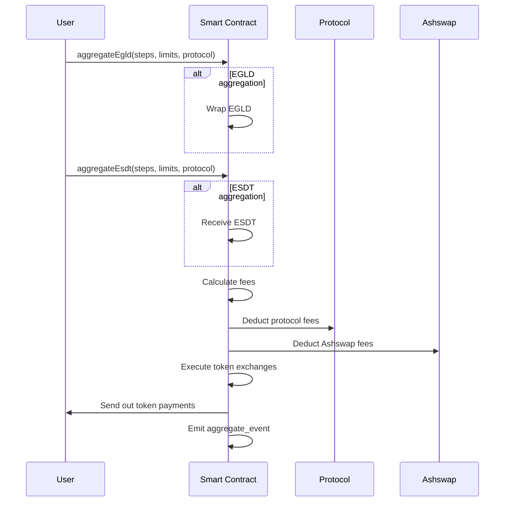

# AshSwap Aggregator Smart Contract

This repository contains the Aggregator smart contract in AshSwap.

## Overview
An aggregator service on the MultiversX blockchain, which facilitates the exchange of tokens across different liquidity pools. It handles the collection of fees for the protocol and a swap service (Ashswap), and allows users to claim these fees. The contract also supports the aggregation of ESDT tokens and EGLD, the native cryptocurrency.

## State Variables
- `protocol_fee`: A map storing the fees accumulated per protocol.
- `ashswap_fee`: A map storing the fees accumulated for Ashswap.
- `protocol_fee_percent`: The fee percentage for a given protocol.
- `ashswap_fee_percent`: The fee percentage for Ashswap.
- `ashswap_fee_address`: The address to which Ashswap fees are sent.

## Flow Diagrams


## Functions Description

- `init`: Initializes the contract with the EGLD wrapper address and wrapped token identifier.
  ```mermaid
  sequenceDiagram
    participant User
    participant Contract
    User->>Contract: init(egld_wrapper_address, egld_wrapped_token_id)
    Contract->>Contract: Store EGLD wrapper address
    Contract->>Contract: Store EGLD wrapped token ID

  ```
- `_find_token_in_vault`: Searches for a token in the vault and returns its index.
  ```mermaid
  sequenceDiagram
    participant Contract
    Contract->>Contract: _find_token_in_vault(tokens, token_id)
    loop Each Token in Vault
        Contract->>Contract: Check if token_id matches
    end
    Contract->>Contract: Return index or None
  ```
- `_upsert_vaults`: Updates or inserts a token amount in the vault.
  ```mermaid
    sequenceDiagram
    participant Contract
    Contract->>Contract: _upsert_vaults(vaults, token_id, amount)
    alt Token Found in Vault
        Contract->>Contract: Update existing token amount
    else Token Not Found
        Contract->>Contract: Add new token with amount
    end
  ```
- `_exchange`: Handles the exchange of tokens using a provided liquidity pool and updates the vaults accordingly.
  ```mermaid
  sequenceDiagram
    participant Contract
    participant Pool as Liquidity Pool
    Contract->>Contract: _exchange(vaults, step)
    Contract->>Contract: Validate token and amount
    Contract->>Pool: Send token_in, execute exchange
    Pool-->>Contract: Return token_out
    Contract->>Contract: Update vaults with token_out
  ```
- `_aggregate`: Aggregates multiple token exchanges and fee deductions, returns the final token payments.
  ```mermaid
    sequenceDiagram
    participant Contract
    Contract->>Contract: _aggregate(payments, steps, limits, protocol)
    Contract->>Contract: Process incoming payments
    Contract->>Contract: Deduct fees (if protocol provided)
    loop Each Step
        Contract->>Contract: Execute _exchange
    end
    Contract->>Contract: Enforce limits, prepare results
  ```
- `aggregate_egld`: Handles the aggregation operation when EGLD is involved.
  ```mermaid
    sequenceDiagram
        participant User
        participant Contract
        User->>Contract: aggregateEgld(steps, limits, protocol)
        Contract->>Contract: Wrap received EGLD
        Contract->>Contract: Call _aggregate
        Contract->>User: Send result tokens
        Contract->>Contract: Emit aggregate_event
  ```
- `aggregate_esdt`: Handles the aggregation operation for ESDT tokens, with the option to return EGLD.
  ```mermaid
    sequenceDiagram
        participant User
        participant Contract
        User->>Contract: aggregateEsdt(steps, limits, egld_return, protocol)
        Contract->>Contract: Receive ESDT tokens
        Contract->>Contract: Call _aggregate
        alt egld_return is true
            Contract->>Contract: Convert to EGLD if needed
        end
        Contract->>User: Send result tokens
        Contract->>Contract: Emit aggregate_event
  ```
- `aggregate`: General aggregation endpoint for ESDT tokens.
  ```mermaid
  sequenceDiagram
    participant User
    participant Contract
    User->>Contract: aggregate(steps, limits)
    Contract->>Contract: Receive ESDT tokens
    Contract->>Contract: Call _aggregate
    Contract->>User: Send result tokens
    Contract->>Contract: Emit aggregate_event
    ```
- `aggregate_event`: Emits an event after an aggregation operation.
- `get_claimable_protocol_fee`: Retrieves claimable fees for a protocol in batches to avoid memory overflow.
  ```mermaid
  sequenceDiagram
    participant Owner
    participant Contract
    Owner->>Contract: claimProtocolFee(protocol) / claimAshswapFee()
    Contract->>Contract: Retrieve fee amounts in batches
    Contract->>Owner: Send claimed fees
    ```
- `register_protocol_fee`: Registers the fee percentage and address for a protocol.
  ```mermaid
  sequenceDiagram
    participant Owner
    participant Contract
    Owner->>Contract: registerProtocolFee(fee_percent, whitelist_address) / registerAshswapFee(fee_percent, whitelist_address)
    Contract->>Contract: Store fee percent and whitelist address
    ```
- `get_claimable_ashswap_fee`: Retrieves claimable Ashswap fees in batches.
  ```mermaid
  sequenceDiagram
    participant Owner
    participant Contract
    Owner->>Contract: claimProtocolFee(protocol) / claimAshswapFee()
    Contract->>Contract: Retrieve fee amounts in batches
    Contract->>Owner: Send claimed fees
    ```
- `register_ashswap_fee`: Registers the fee percentage and address for Ashswap.
  ```mermaid
  sequenceDiagram
    participant Owner
    participant Contract
    Owner->>Contract: registerProtocolFee(fee_percent, whitelist_address) / registerAshswapFee(fee_percent, whitelist_address)
    Contract->>Contract: Store fee percent and whitelist address
    ```
- `claim_protocol_fee`: Allows the protocol to claim their accumulated fees.
- `claim_protocol_fee_by_tokens`: Allows the protocol to claim fees for specific tokens.
- `claim_ashswap_fee`: Allows Ashswap to claim their accumulated fees.
- `claim_ashswap_fee_by_tokens`: Allows Ashswap to claim fees for specific tokens.

